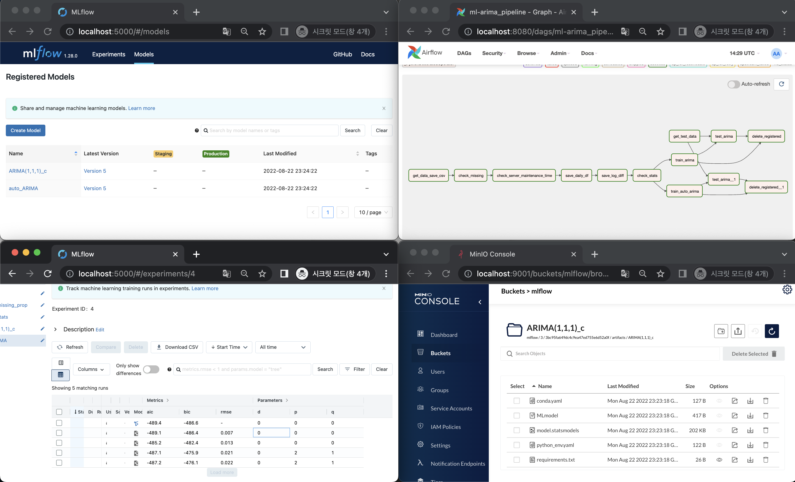

# mlflow-airflow-exercise

## Sample Image



- more result images on:
    - https://github.com/instork/mlflow-airflow-exercise/blob/main/result.md

&nbsp;

## Prerequisites
- Install docker
- Install docker-compose
- Create .env like below for docker compose
    ```
    # if you are running on a cloud or server
    # port-forward on 8080, 9000, 9001, 5000 is needed 
    MLFLOW_S3_ENDPOINT_URL=http://<External IP>:9000
    MLFLOW_TRACKING_URI=http://<External IP>:5000

    # if you are running on local server
    # localhost doesn't work. Use internal IP like 192.x.x.x.
    # How to find internal IP: https://www.avast.com/c-how-to-find-ip-address

    MLFLOW_S3_ENDPOINT_URL=http://<Internal IP>:9000
    MLFLOW_TRACKING_URI=http://<Internal IP>:5000


    _AIRFLOW_WWW_USER_USERNAME=airlfow
    _AIRFLOW_WWW_USER_PASSWORD=airlfow

    AWS_ACCESS_KEY_ID=mlflow
    AWS_SECRET_ACCESS_KEY=mlflow

    AWS_REGION=us-east-1
    AWS_BUCKET_NAME=mlflow
    MYSQL_DATABASE=mlflow
    MYSQL_USER=mlflow
    MYSQL_PASSWORD=mlflow
    MYSQL_ROOT_PASSWORD=mlflow_pwd

    MONGODB_USER=airflow
    MONGODB_PWD=airflow
    MONGODB_HOST=mongoservice
    MONGODB_PORT=27017

    # if you want to use fred data
    FRED_API_KEY=<FRED_API_KEY>
    ```

&nbsp;

## How to run
- run docker-compose
    ```bash
    $ docker-compose up
    $ docker-compose up --build --remove-orphans --force-recreate
    $ docker-compose up --build --remove-orphans --force-recreate --detach
    ```

- stop docker-compose
    ```bash
    $ docker-compose down
    $ docker-compose down --volumes --remove-orphans
    ```

- remove data
    ```bash
    $ docker-compose down
    $ docker-compose down --volumes --remove-orphans
    ```

- To get OHLCV of BTC run `de-upbit2db` DAG
- To train ARIMA and auto-ARIMA run `ml-arima_pipeline` DAG
    - At least 121 days of BTC ohlcv must be collected to run ARIMA DAG.
    - You can change dag configs on each DAG python file for smaller ohlcvs days.

- Airflow:
    - http://localhost:8080/
- MLflow
    - http://localhost:5000/
- MinIO
    - http://localhost:9001/

&nbsp;

## Data Time
- Data Request Time 
    - Upbit Data : every hour from 00:00 (UCT)
    - Google News : every day from 00:00 (Eastern Time: EST EDT)
    - Fred Data : every day from 00:00 (Eastern Time: EST EDT) (missing on weekend & holidays)

&nbsp;

## Check data
``` bash
$ docker ps -a --filter name=mongo 
$ docker exec -it <CONTAINER ID> /bin/bash    
$ mongo -u airflow -p airflow
$ show dbs
$ use test_db
$ show collections
$ db["<collection_name>"].find()
$ db["USDT-BTC"].find({}).sort({"candle_date_time_utc":1}).limit(1);
$ db.dropDatabase() # to Drop database
$ db["USDT-BTC"].find({}).sort({"utc_time":-1}).limit(1)
$ db["news"].find({}).sort({"etz_time":-1}).limit(1);
$ db["fred"].find({}).sort({"etz_time":-1}).limit(1);
```

&nbsp;

## (Optional) Prerequisites for MongoDB on local
- Make mongodb user
    - https://medium.com/mongoaudit/how-to-enable-authentication-on-mongodb-b9e8a924efac
- Connecting from a Docker container to a local MongoDB
    - https://tsmx.net/docker-local-mongodb/
- Use docker-compose-localdb.yaml as docker-compose.yaml
    ```bash
    $ docker-compose -f docker-compose.localdb.yaml up
    $ docker-compose -f docker-compose.localdb.yaml up --build --remove-orphans --force-recreate
    $ docker-compose -f docker-compose.localdb.yaml up --build --remove-orphans --force-recreate --detach
    ```
    ```bash
    $ docker-compose -f docker-compose.localdb.yaml down
    $ docker-compose -f docker-compose.localdb.yaml down --volumes --remove-orphans
    ```

## References
- Dockerized MLFlow Server
    - https://github.com/Toumash/mlflow-docker
    - https://www.mlflow.org/docs/latest/tracking.html#scenario-4-mlflow-with-remote-tracking-server-backend-and-artifact-stores
- Latest DE part
    - https://github.com/instork/airflow-api2db-exercise